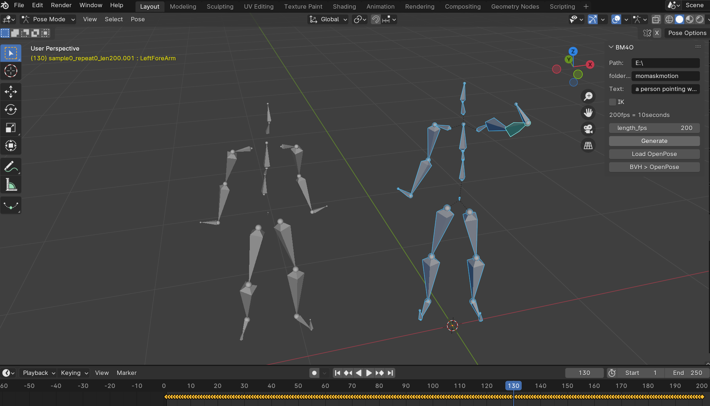
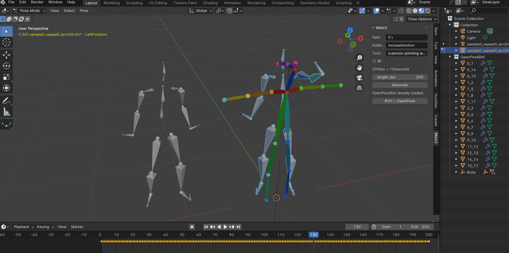
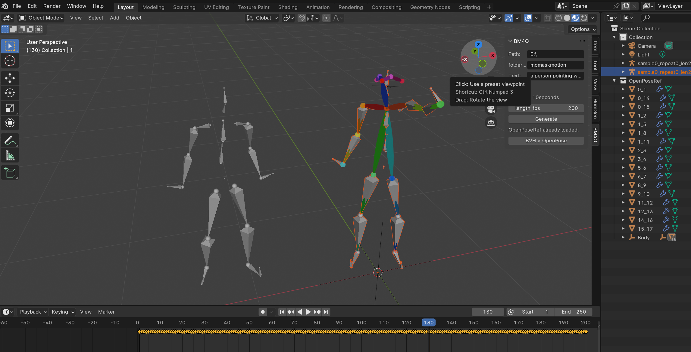

# BM4O
Blender_Momask_for_Openpose
This addon relays on Momask Project: https://github.com/EricGuo5513/momask-codes;

Since, it is not easy to retarget, I add the openpose rig for it
Thanks to makeInuFilm and his original article：https://note.com/makeinufilm/n/nfe271a0aa1ea?sub_rt=share_pb

BM4O use MomaskSever get generated pose as BVH:

BM4O then create a OpenPose:

BM4O then retarget for BVH:

BM4O can easily switch between different generated BVH:

Known issue:
Path settings are not easy to use at the moment!

